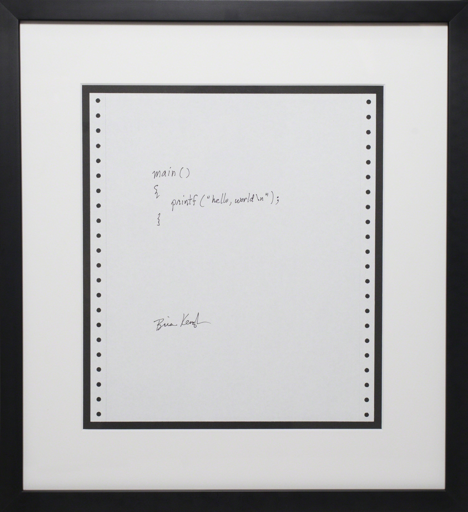

大一的课上,老师让我们背一条链：预处理、编译、汇编、链接。我背下来了,考试也答对了。

但有个问题一直卡在心里,没人回答：最后那堆机器码,到底是怎么让一块硅片"算出" 1 + 1 = 2 的?

这篇文章就是我当时想要、却没找到的那份答案。我用一行最简单的加法函数,把它从 C 源码一路追到 CPU 里的逻辑门。每一步都给出你能自己敲一遍的命令。

<!-- more -->

## 先回答：为什么偏偏用 C 折磨新生

在讲四步之前,得先解决一个更朴素的疑问：为什么大学不从 Python 教起,非要拿 C 开刀?

因为 C 几乎是"能被人读的机器语言"。它的每条语句大多能对应到有限的几条机器指令,离硬件足够近,近到能让你亲眼看见抽象崩塌的地方,比如指针越界、内存布局、栈帧结构;可它又比手写汇编高一层,不至于让你淹死在寄存器编号里。

想搞清楚"代码怎么变成电",C 是性价比最高的那一刀切片。

我们全程只用一个主角：

```c
// add.c
int add(int a, int b) {
    return a + b;
}
```

就这三行。接下来跟着它走完四步,再走进 CPU。

## 第一步：预处理,一次纯粹的文本替换

```bash
gcc -E add.c
```

预处理器根本不懂 C 语法,它只做三件事：展开 `#include`、替换 `#define` 宏、处理 `#if` 条件编译。本质就是字符串替换。

我们的 `add.c` 没有宏也没有头文件,所以它几乎原样通过。但在真实项目里,这一步会把一个几十行的源文件膨胀成上万行(一个 `#include <stdio.h>` 就能展开出几百行)。

预处理"无脑"到什么程度?看这个经典的坑：

```c
#define SQUARE(x) x * x
int r = SQUARE(3 + 1);   // 你以为是 16
```

预处理后它变成了 `int r = 3 + 1 * 3 + 1;`,结果是 7。因为宏不是函数调用,它只是把 `x` 原样替换成 `3 + 1`,乘法优先级把一切搅乱了。

:::warning[宏不是函数]
这也是为什么老手写宏永远给每个参数和整体都套上括号：`#define SQUARE(x) ((x) * (x))`。预处理阶段的 bug 最难查,因为报错发生在你根本没写过的那行"展开后"的代码上。
:::

## 第二步：编译,从 C 到汇编

```bash
gcc -S add.c -O0 -o add.s
```

这是四步里最"重"的一步,一个完整的编译器前后端都在这里：词法分析、语法分析(建 AST)、语义检查(类型对不对)、生成中间表示、优化,最后吐出目标架构的汇编。

在 x86-64 Linux 上,`-O0`(不优化)输出的核心是这样(我删掉了 `.cfi_*`、`.LFB0` 这类给汇编器和调试器看的伪指令,只留真正的机器指令)：

```asm
add:
    endbr64                  # CET 控制流保护,现代 gcc 默认插入
    pushq   %rbp             # 保存调用者的栈帧基址
    movq    %rsp, %rbp       # 建立本函数的新栈帧
    movl    %edi, -4(%rbp)   # 参数 a(在 edi 里)存到栈上
    movl    %esi, -8(%rbp)   # 参数 b(在 esi 里)存到栈上
    movl    -4(%rbp), %edx   # a 读回到 edx
    movl    -8(%rbp), %eax   # b 读回到 eax
    addl    %edx, %eax       # eax = eax + edx   ← 真正的加法在这里
    popq    %rbp             # 恢复栈帧
    ret                      # 返回,结果约定放在 eax
```

有两个细节值得停下来看：

第一,参数 `a`、`b` 不是从栈上拿的,而是从寄存器 `edi`、`esi` 直接来的。这是 System V AMD64 调用约定：前几个整型参数走寄存器,比压栈再读快得多。

第二,真正干活的只有一条 `addl %edx, %eax`。上面那一堆 `mov` 都是 `-O0` 老老实实的搬运。

:::tip[开 -O2 看看编译器有多"懒"]
把 `-O0` 换成 `-O2`,gcc 会把整个函数优化成一条 `leal (%rdi,%rsi), %eax`,借地址计算单元一步算出和,连栈都不碰。同一份 C 代码,优化前后的机器码可以差好几倍。这也是为什么"读汇编"是理解性能的必修课。
:::

## 第三步：汇编,助记符变成二进制

```bash
gcc -c add.c -O0 -o add.o
objdump -d add.o
```

汇编器(as)干的事很机械：把每条助记符翻译成对应的机器码字节,再打包成目标文件 `.o`,里面装着机器码、符号表和重定位信息。

反汇编出来是这样：

```text
0000000000000000 <add>:
   0:   f3 0f 1e fa    endbr64
   4:   55             push   %rbp
   5:   48 89 e5       mov    %rsp,%rbp
   8:   89 7d fc       mov    %edi,-0x4(%rbp)
   b:   89 75 f8       mov    %esi,-0x8(%rbp)
   e:   8b 55 fc       mov    -0x4(%rbp),%edx
  11:   8b 45 f8       mov    -0x8(%rbp),%eax
  14:   01 d0          add    %edx,%eax
  16:   5d             pop    %rbp
  17:   c3             ret
```

盯住中间那一列。`add %edx, %eax` 就是两个字节：`01 d0`。

把它拆开：

- `01` 是操作码(opcode)。在 x86 里,它的意思是"把一个 32 位寄存器加到另一个 32 位寄存器或内存"。
- `d0` 是 ModR/M 字节,负责说明"到底是哪两个寄存器"。它的二进制 `11 010 000` 里,`010` 是 edx 的编号,`000` 是 eax 的编号。

也就是说,你写的那个 `a + b`,到这里已经被浓缩成 16 个比特。CPU 接下来要执行的,就是这 16 个比特。

## 第四步：链接,把碎片拼成能跑的程序

```bash
gcc add.o -o app      # 内部调用 ld 完成链接
```

一个 `.o` 还不能直接跑。它可能调用了别处定义的函数(比如 `printf` 在 libc 里),这些"外部符号"在编译时只留了个占位。链接器解决两件事：

- **符号解析**：把"我要用的 printf"和"libc 里那个 printf 的定义"对上号。
- **重定位**：等所有代码段拼到一起、地址尘埃落定,再把之前的占位填成真实地址。

链接完成,你才拿到一个操作系统能装载执行的 ELF 可执行文件。

四步走完,汇总成一张表：

| 步骤 | 命令 | 输入 → 输出 | 本质 |
|:----:|:----:|:----:|:----:|
| 预处理 | `gcc -E` | `.c` → `.i` | 文本替换 |
| 编译 | `gcc -S` | `.i` → `.s` | 生成汇编 |
| 汇编 | `gcc -c` | `.s` → `.o` | 助记符转机器码 |
| 链接 | `gcc` / `ld` | `.o` → 可执行文件 | 符号解析与重定位 |

## 高潮：16 个比特凭什么"算"出了加法

现在回到那个真正折磨我的问题。CPU 拿到 `01 d0` 这 16 个比特,凭什么就"算"出了加法?

CPU 干的活,可以粗暴地概括成一个永不停歇的三拍循环：取指(Fetch)、译码(Decode)、执行(Execute)。

```text
        ┌──────┐   地址   ┌──────────┐
        │  PC  │ ───────► │ 指令内存  │
        └──────┘          └────┬─────┘
                                │ 取出 01 d0
                                ▼
                        ┌───────────────┐
                        │ 控制单元 / 译码 │  读 opcode = 01
                        └──┬────┬────┬───┘
             选 edx/eax ───┘    │    └─── ALUop = 加法
                                │
             ┌──────────┐       │        ┌──────────┐
             │  寄存器堆 │ ──────┴──────► │   ALU    │
             │  edx eax │ ◄──── 写回 ──── │ (加法器)  │
             └──────────┘                └──────────┘
```

1. **取指**：程序计数器 PC 存着下一条指令的地址。CPU 按这个地址从内存(实际是 i-cache)取出 `01 d0`,放进指令寄存器。
2. **译码**：控制单元本质是一大片组合逻辑,你可以把它想成一个巨大的译码器。它读到 opcode `01`,输出一组控制信号。这些信号像开关一样,决定这一拍里：从哪两个寄存器读数(edx、eax)、ALU 该做哪种运算(加法而非减法或与或)、结果写回哪里(eax)。
3. **执行**：操作数从寄存器堆读出,送进 ALU。ALU 是个多面手,能加能减能与能或,而上一步的控制信号通过一个多路选择器(MUX),恰好选中了"加法"这条输出。

关键就藏在 ALU 的加法器里。它不是什么魔法,是一堆逻辑门。

最小的单元叫**全加器**(full adder),负责算一个二进制位。它吃三个输入：本位的两个比特 A、B,以及低位传上来的进位 Cin;吐两个输出：本位的和 S,以及要送给高位的进位 Cout。

它的逻辑只有两行：

```text
S    = A ⊕ B ⊕ Cin                    三个数里有奇数个 1,本位就是 1
Cout = (A · B) + (Cin · (A ⊕ B))      至少凑够两个 1,就向高位进位
```

这里 `⊕` 是异或门,`·` 是与门,`+` 是或门。换句话说,"加法"这件事,落到最底层,就是几个逻辑门的开与合。

把 32 个全加器串起来,让低位的 Cout 接到高位的 Cin,就能算 32 位加法：

```text
  A31 B31        A1 B1         A0 B0
   │   │          │  │          │  │
   ▼   ▼          ▼  ▼          ▼  ▼
 ┌───────┐      ┌──────┐     ┌──────┐
 │全加器31│◄─...─│全加器1│◄────│全加器0│◄── Cin=0
 └───┬───┘      └──┬───┘     └──┬───┘
     ▼             ▼            ▼
    S31           S1           S0
```

这就是 `addl %edx, %eax` 背后真正发生的事：edx 和 eax 的 32 个比特,一位一位喂进 32 个全加器,逻辑门在一个时钟周期内稳定下来,输出 32 位的和,再写回 eax。

于是,"背下来的四步"和"门电路"就这样接上了：

> C 源码 → 汇编助记符 → 机器码 `01 d0` → 控制信号 → 选中 ALU 加法 → 全加器里的异或、与、或门 → 一个数。

从你按下回车,到硅片上一串门电路翻转,中间没有任何魔法,只有一层层可以拆开的抽象。

## 必须说清楚的简化

:::note[这是教学模型,不是你手机里的 CPU]
上面那套"一拍取指、一拍译码、一拍执行"是教科书里的单周期模型,方便理解,但和真实处理器差得远：

- 真实 CPU 是**流水线**的,多条指令像工厂流水线一样重叠推进;还有乱序执行、超标量,一个周期能发射多条指令。
- 一位一位等进位的**行波进位加法器**太慢,实际用的是超前进位(carry-lookahead)等结构,提前把进位算出来。
- x86 指令还会先被拆成更小的**微操作**(micro-ops)再执行,`01 d0` 未必真的一拍算完。
- 中间还隔着多级缓存、分支预测、寄存器重命名。

但这些都是在这套骨架之上做的加速。理解了单周期模型,你才有拆开它们的第一把钥匙。
:::

## 写在最后

回头看,这个问题真正教会我的,不是某条指令怎么编码,而是一种习惯：遇到一层抽象,试着往下再捅一层。

C 之下是汇编,汇编之下是机器码,机器码之下是门电路,门电路之下还有晶体管和物理。每往下一层,"魔法"就少一分,可解释的确定性就多一分。

如果你也卡在同一个问题上,别再背那四步了。找一台 Linux(Windows 上用 WSL 也行),把下面几条命令亲手敲一遍：

```bash
gcc -S add.c -O0 -o add.s      # 看它变成汇编
gcc -c add.c -O0 -o add.o      # 再变成机器码
objdump -d add.o               # 亲眼找到那个 01 d0
```

当你在 `objdump` 的输出里第一次认出 `01 d0`,并且知道它最终落在几个逻辑门上时,"编译四步"就再也不是需要背的东西了。它变成了你看得见、也讲得清的一条路。

<figure class="figure figure--center">
  
  <figcaption class="figure-caption">Brian Kernighan于1978年亲笔书写的“Hello World”程序</figcaption>
</figure>

